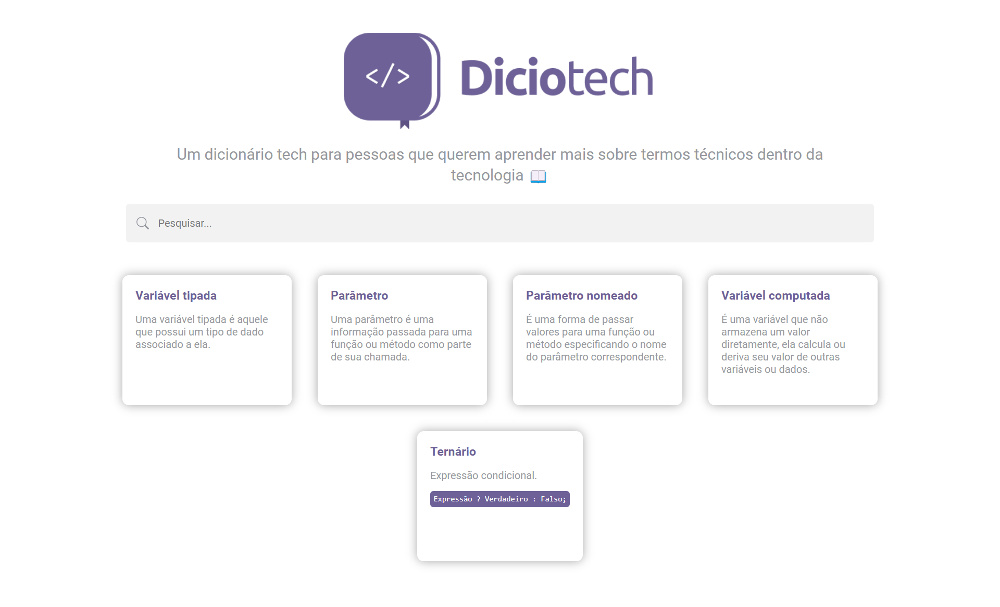

  

---

O Diciotech é um dicionário tech online colaborativo, construído com HTML, SASS e JavaScript, e open source. Nossa missão é ajudar pessoas de todos os níveis a entenderem termos e conceitos relacionados à tecnologia de forma clara e simples.

Ao utilizar o Diciotech, você pode:

* Aprender novos termos de forma rápida e fácil.
* Contribuir para a construção de uma comunidade de aprendizado em tecnologia.
* Aprimorar suas habilidades técnicas de forma colaborativa.

Junte-se à nossa comunidade no [GitHub](https://github.com/levxyca/diciotech/discussions) para discutir sobre o projeto!

## 🤝 Contribua

Qualquer contribuição é muito bem-vinda! Confira a documentação [CONTRIBUTING.md](CONTRIBUTING.md) para conhecer todas as formas de contribuir com o projeto. Por exemplo, [sugerir uma nova funcionalidade](https://github.com/levxyca/diciotech/issues/new?assignees=&labels=&template=feature_request.md&title=), [reportar um problema/bug](https://github.com/levxyca/diciotech/issues/new?assignees=&labels=bug&template=bug_report.md&title=), [enviar um pull request](https://help.github.com/articles/about-pull-requests/) ou simplemente utilizar o projeto e comentar sua experiência.

Verifique o arquivo [ROADMAP.md](ROADMAP.md) para se manter por dentro de como o projeto deve evoluir.

**Trabalhando na sua primeira contribuição?** Confira também o artigo [Como Contribuir para o Open Source](https://opensource.guide/pt/how-to-contribute/).

### Principais pessoas contribuidoras

